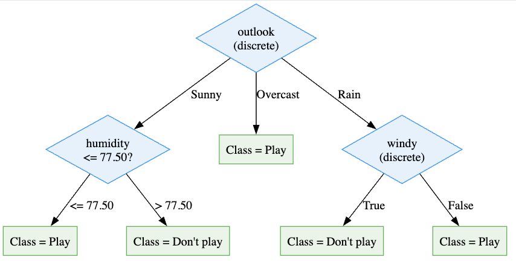

# C4.5

An implementation of C4.5 machine learning algorithm in python

## C4.5 Algorithm

C4.5 is an algorithm developed by John Ross Quinlan that creates decision tress. A decision tree is a tool that is
used for classification in machine learning, which uses a tree structure where internal nodes represent tests and
leaves represent decisions. C4.5 makes use of information theoretic concepts such as entropy to classify the data.


### Visualization generated from implementation in the repo



## Data Format

For each dataset there should be two files, one that describes the classes and attributes and one that consists
of the actual data. The file for attributes and classes should contain all the classes in first line and after that,
line by line the attributes and their possible values if the attribute is discrete. For continuos(numerical) attributes,
possible values would be "continuos". Check the iris dataset folder for actual data and more specific syntax.

## Usage

Create a C4.5 object like this

```python
c1 = C45("path_to_data_file", "path_to_description_file", maxDepth)
```

After this, you can fetch and preprocess the data, generate the tree and print it to screen.

## Running Tests

Navigate to the directory "_C4.5_" and type `python -m unittest discover` to run all the test modules under "_C4.5/tests_" folder. (the names of the modules should start with "_test_" and end with "_.py_")

## Relevant Links

- https://en.wikipedia.org/wiki/C4.5_algorithm
- https://en.wikipedia.org/wiki/Decision_tree_learning
- http://www.rulequest.com/Personal/
- http://www2.cs.uregina.ca/~dbd/cs831/notes/ml/dtrees/c4.5/tutorial.html
